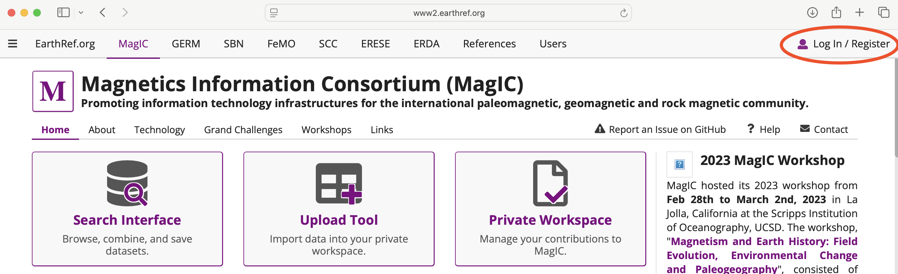
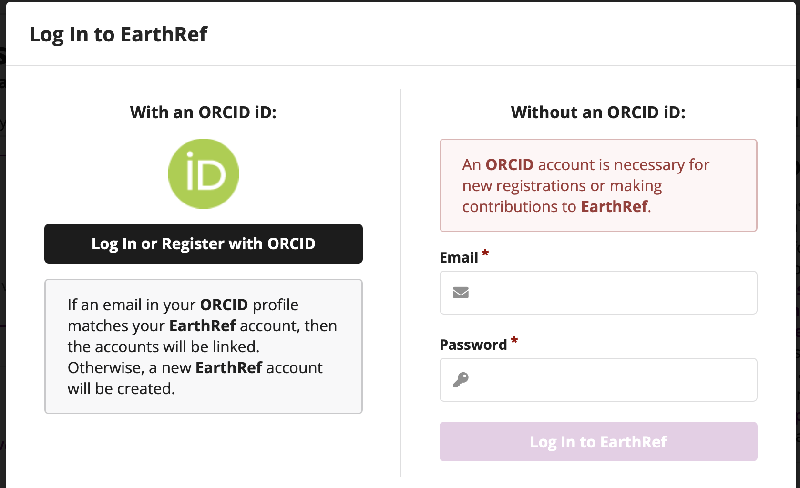
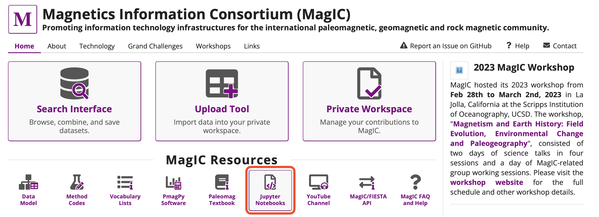
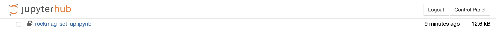
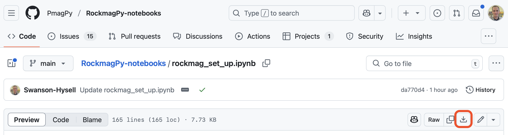
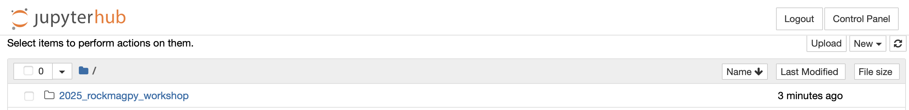

# Steps to take before the workshop

Thanks for planning to attend the workshop on rock magnetic data archiving and processing. The workshop will be Thursday, June 12th, 9:00 to 15:30 in Tate Hall Room 401-20. The schedule for the workshop can be found here: https://github.com/Institute-for-Rock-Magnetism/2025_rockmagpy_workshop/blob/main/README.md We will be working with code and documentation that is in active development called `rockmagpy`. Documentation associated with rockmagpy can be found here: https://pmagpy.github.io/RockmagPy-notebooks/book/intro.html

Given the goal of workshop participants getting hands-on experience, please complete the following steps prior to Thursday morning. Let Nick Swanson-Hysell or Yiming Zhang know if you have any issues and we can help before 

1. Log in with ORCID to create an EarthRef account. To do so, go to https://www2.earthref.org/MagIC and click-on *Log In / Register* in the upper right.

Then click *Log In or Register with ORCID*

2. Navigate to the MagIC Jupyterhub either from the MagIC site or directly from this link: https://jupyterhub.earthref.org/

3. Log in to the JupyterHub with your Earthref credentials

4. Once you are on JupyterHub, open the `rockmag_set_up.ipynb` notebook:

*Note that if you have previously accessed the MagIC JupyterHub, that you need to upload the latest version of the rockmagpy set-up notebook into your main JupyterHub folder. To download the notebook go to: https://github.com/PmagPy/RockmagPy-notebooks/blob/main/rockmag_set_up.ipynb and click the download button:*

5. Follow the directions withing the setup notebook and executing the cells. By doing so you will install the workshop materials into your JupyterHub. We be working in a notebook called `rockmag_data_unpack.ipynb` within the `2_MagIC_hysteresis` folder of the `2025_Rockmagpy_workshop` folder. As well as with notebooks in the `2025_Rockmagpy_workshop` folder

*Note: If you are an experienced Python user, it could work for you to run the notebooks locally during the workshop. Advantages of running locally are that the code could run more quickly which is particularly nice for some of the interactive analysis tools.*