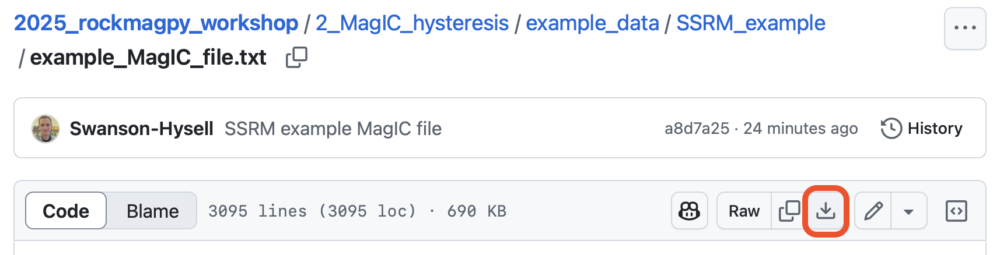

# Anatomy of a MagIC contribution and processing data with `rockmagpy`

The Magnetics Information Consortium (MagIC), hosted at http://earthref.org/MagIC is a database that serves as a Findable, Accessible, Interoperable, Reusable (FAIR) archive for paleomagnetic and rock magnetic data. Its data model is fully described here: [https://www2.earthref.org/MagIC/data-models/3.0](https://www2.earthref.org/MagIC/data-models/3.0). Each contribution is associated with a publication via the DOI.  

There are nine data tables. The fields associated with these tables are detailed here: https://www2.earthref.org/MagIC/data-models/3.0. The tables associated with all studies that have measurement level data are:

- contribution: metadata of the associated publication.
- locations: metadata for locations, which are groups of sites (e.g., stratigraphic section, region, etc.)
- sites: metadata and derived data at the site level (units with a common expectation)
- samples: metadata and derived data at the sample level.
- specimens: metadata and derived data at the specimen level.
- measurements: metadata and measurements at the specimen level.

These additional tables can be provided:
- criteria: criteria by which data are deemed acceptable
- ages: ages and metadata for sites/samples/specimens
- images: associated images and plots.  

## Let's upload a contribution! 

1. Navigate to download this MagIC file which contains data generated by one of the IRM Summer School groups in 2024: https://github.com/Institute-for-Rock-Magnetism/2025_rockmagpy_workshop/blob/main/2_MagIC_hysteresis/example_data/SSRM_example/example_MagIC_file.txt

2. Download the MagIC file locally to your computer by clicking the download button:

   

3. Log-in to MagIC/Earthref (https://www2.earthref.org/MagIC).

4. Go to upload tool (https://www2.earthref.org/MagIC/upload)

5. Drag and drop the file into the upload tool.

   

6. Upon uploading, we can examine the tables which are parsed and matched up with the table name and data model fields.

   

7. Click the upload button in the lower right, which will bring you to an upload page where you can click through to upload data into your private workspace.
   
   

8. Add the lab for the study `Institute for Rock Magnetism` and then click save.
   
   

9. These data are now in MagIC as a private contribution. We could click validate to validate the contribution and then publish it, but we won't do that with these data. What we can do is to get a private link that can be shared. Sharing such a link enables data to be made available for peer review. Note that the DOI for the contribution (Future Data DOI) is already available at this stage which enables the data to be properly referenced within a manuscript when it is submitted. 

   

10. We can also bring data from a private in our workspace into a notebook for analysis which we will do below.

# Part 2: Inspecting the contribution and processing hysteresis data

We will use a Jupyter notebook that is hosted on the EarthRef.org JupyterHub server to process:

 https://jupyterhub.earthref.org/ 

This JupyterHub enables you to run PmagPy code without having to install anything locally. You can get to it via the MagIC website:

Once you are on JupyterHub, open the `rockmag_set_up.ipynb` notebook:

By executing cells in this setup notebook, you will install the workshop materials into your JupyterHub. We will now be working in a notebook called `rockmag_data_unpack.ipynb` within the `2_MagIC_hysteresis` folder of the `2025_Rockmagpy_workshop` folder.

We will use the MagIC_rockmagpy_intro notebook to inspect a MagIC contribution using `PmagPy` functions and then analyze/visualize hysteresis and other rock magnetic data using `rockmagpy` functions.

